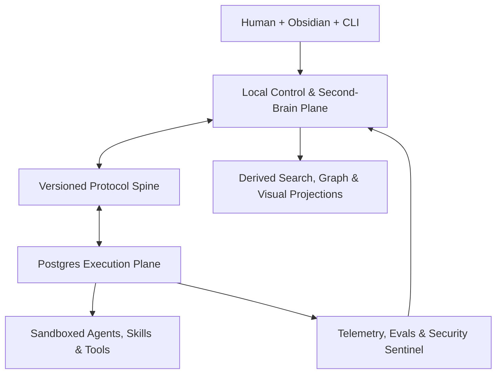
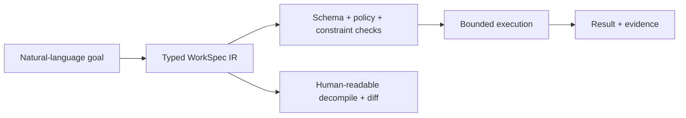

# Beast Agentic — Agentic OS Continuation and Build Blueprint

Blueprint version: `0.1-draft`

Audit date: 2026-07-11

Baseline: public `agentic-os` at `65ff1fe` (U-C2 complete) and private
`ai-company-runtime` at `d6f4a82`

Canonical product name: **Beast Agentic**

Compatibility names: repository `agentic-os`, CLI `aos`, and Python package
`agentic_os` remain unchanged until a separately approved, backwards-compatible
rename migration.

This document is the build authority for work after U-C2. Historical research,
Night-1, Weekend, two-week, U-C1, and U-C2 documents remain evidence and design
history. They are not erased. The original five-item continuation sequence in
§2 is canonical and must not be reordered by the broader roadmap.

“No one has ever built this” cannot be proven honestly. Many individual
mechanisms below already exist in research or products. Beast Agentic's intended
differentiation is the governed combination: local-first second brain, typed
multi-agent execution, proof-carrying results, memory provenance, semantic
interrupts, adaptive routing, policy enforcement, and recovery that work as one
coherent system.

---

## 1. Executive verdict

Beast Agentic should become a **local-first cognitive control plane plus a
bounded execution mesh**, not a single giant autonomous program.

- **SQLite remembers human intent, memory, decisions, approvals, and proof.**
- **Markdown/Obsidian shows and lets the human navigate the system.**
- **Postgres runs durable operational work with leases, policy, spend, and
  workers.**
- **Versioned envelopes cross boundaries. Databases never do.**
- **Models propose and reason; deterministic code validates and constrains.**
- **Every side effect has an identity, policy decision, idempotency key,
  budget, evidence contract, and rollback or compensation plan.**
- **Autonomy is earned per capability and risk class. It is never a global
  “trust level” switch.**

The system becomes useful long before every frontier layer exists:

1. **Local beta:** finish U-C3 → U-C4 → U-H1, then release plumbing.
2. **Second-brain beta:** migration framework, Memory Galaxy, project cockpit,
   research and review workflows.
3. **Bounded-agent beta:** typed WorkSpecs, specialist agents, skill registry,
   human interrupts, result-envelope bridge.
4. **Production candidate:** policy gateway, sandboxing, eval/drift system,
   observability, recovery drills.
5. **Frontier Beast:** learned routing, prompt evolution, cross-framework mesh,
   cross-cloud continuity, economic negotiation, and serendipity—each behind a
   measured promotion gate.

## 2. The canonical continuation from U-C2

| Order | Unit | GitHub/build state | Exact next result |
|---:|---|---|---|
| 1 | **U-C1 input hardening** | ✅ merged and tagged | Preserve as immutable baseline |
| 2 | **U-C2 backup / verify / restore** | ✅ merged and tagged; current public `main` | Preserve recovery contract |
| 3 | **U-C3 secret warn-on-write + doctor sweep** | 🟡 authoritative contract prepared; implementation not yet started from the verified U-C2 baseline | Implement as one bounded PR |
| 4 | **U-C4 Windows Obsidian export** | ⬜ not built | Read-only export with containment, dry run, and atomic replacement |
| 5 | **U-H1 SessionEnd dropfile hook + trust-gated installer** | ⬜ not built | Hook writes a dropfile only; installer is previewable and reversible |

No advanced memory, orchestration, MCP, routing, or autonomy milestone may jump
ahead of U-C3, U-C4, and U-H1. U-H2 success-claim checks, additional input
validation, packaging, and CI remain later bounded units and must land separately
after the five-item spine unless a new explicit decision changes that order.

### 2.1 Immediate landing sequence

1. Preserve the historical `v0.2-u-c3-secret-scan` branch and the verified
   pre-U-C3 safety snapshot.
2. Review/freeze the prepared U-C3 contract and implement only its scanner,
   warnings, doctor sweep, tests, docs, and decisions from a clean U-C2-based
   branch.
3. Run the complete local gate, review the diff, then open the U-C3 PR.
4. Build and land U-C4 from the U-C3 merge commit.
5. Build and land U-H1 from the U-C4 merge commit.
6. Build and land the planned U-H2 proof checks as their own PR.
7. Land packaging, installed entrypoints, CI, and release governance as U-P1.
8. Add migrations before changing the memory schema.

## 3. Current truth, limitations, and upgrades

### 3.1 What is already real

The public control plane already has capture, triage, legal task transitions,
deterministic context packs, run and handoff records, evidence-gated completion,
dropfile ingest, a small agent registry, memory rows, search, daily/weekly/project
reviews, one-way Obsidian rendering, doctor checks, and verifiable SQLite backup
and restore.

The private runtime already has a Postgres queue, worker leases and retries,
policy registry, approvals, spend reservations and kill switch, and append-only
decision and prediction records. Its latest inspected commit reports 514 passing
tests and 20 skipped tests, but its root README still describes the old ECC
starter kit instead of the runtime it now contains.

### 3.2 Limitations to remove deliberately

| Present limitation | Beast Agentic upgrade | First unit |
|---|---|---|
| U-C3 has an older contract branch but no verified implementation | Implement from the clean U-C2 baseline under the new contract | U-C3 |
| No safe Windows/Obsidian export | Contained, atomic, read-only export projection | U-C4 |
| Session write-back is manual | Dropfile-only SessionEnd hook; no auto-ingest | U-H1 |
| No remote CI or installable release on public `main` | Wheel/entrypoint/zipapp, SHA-pinned CI, branch protection | U-P1 |
| Schema version 1 has no migration engine | Backup-first transactional migrations with fixtures | U-M1 |
| Memory is text-row based, weakly verified, and only lightly contextual | Typed claims, temporal validity, provenance graph, curation states | U-M2–U-M6 |
| Context packs are static snapshots | Token-budgeted context shards and hydration receipts | U-M6/U-W2 |
| Agent registry has names, not measured capability contracts | Signed Agent Passports and per-task-family fitness | U-A1–U-A3 |
| No skill lifecycle or supply-chain model | Versioned Skill Manifests, tests, permissions, signatures | U-K1–U-K4 |
| Public AOS coordinates but does not orchestrate | Typed WorkSpec compiler and explicit runtime adapter | U-W1/U-X1 |
| Runtime repository functions are not an operator surface | Authenticated API, approval console, telemetry, runbooks | U-D2 |
| No cross-repository trace | Result Envelope with trace/correlation/causation IDs | U-X1 |
| No MCP/A2A boundary | Governed tool gateway first, protocol adapters second | U-T2–U-T4 |
| No hallucination/drift promotion gate | Claim audit, eval registry, canary, rollback | U-E2–U-E4 |
| No production isolation | Landlock locally; gVisor/OCI sandbox in runtime | U-S3 |
| No multi-cloud continuity | Active/passive continuity capsule and DR drills | U-X4/U-X5 |
| No agent economy | Internal RFQ and reserved-budget simulation before payments | U-Q1–U-Q5 |

### 3.3 GitHub flow audit

As inspected on 2026-07-11:

- public [`agentic-os`](https://github.com/gamerboye555000-spec/agentic-os)
  has only `main`, no open PRs or issues, and remote `main` ends at
  [`65ff1fe`](https://github.com/gamerboye555000-spec/agentic-os/commit/65ff1fef6fc17901789b59ae17aa337c336e37d9)
  for U-C2; U-C1 landed at
  [`bd710fe`](https://github.com/gamerboye555000-spec/agentic-os/commit/bd710fedb67cf2d57976dc6330cdec4eec97b52d);
- the public history used direct `main` commits and remote `main` has no CI
  workflow; no CI implementation is present in the verified `agentic-os` tree;
- private
  [`ai-company-runtime`](https://github.com/gamerboye555000-spec/ai-company-runtime)
  also has only `main` and no open PRs/issues; its latest inspected merge is
  [PR #43 / `d6f4a82`](https://github.com/gamerboye555000-spec/ai-company-runtime/pull/43),
  which reports the decision/prediction records and green test gate;
- the private repository demonstrates reviewed PR delivery, but its root README
  is stale and its workflow actions still need immutable SHA pins.

Therefore U-C3 begins the public repository's bounded PR discipline; U-P1 makes
that discipline enforceable with required CI and branch protection.

## 4. Product laws — the Beast Constitution

These are hard invariants. Configuration may make them stricter, never weaker.

1. **Human ownership.** The human can export, inspect, back up, restore, pause,
   and delete their data without a cloud service.
2. **Evidence before completion.** High-confidence or successful claims require
   linked evidence appropriate to their risk.
3. **Append-only accountability.** Corrections supersede prior records; they do
   not silently rewrite decisions, approvals, bids, results, or memory history.
4. **Least agency.** Every agent, skill, model, and tool receives only the data,
   permissions, time, and money needed for one scoped operation.
5. **Typed boundaries.** Cross-process and cross-repository messages validate
   against a versioned schema before business logic sees them.
6. **Deterministic enforcement.** An LLM never authorizes itself, verifies its
   own proof as the sole judge, raises its own budget, widens its own tool scope,
   or promotes its own prompt/model/skill version.
7. **No shared databases.** The control plane and execution plane exchange
   artifacts and IDs; neither reads or writes the other's tables.
8. **Derived means disposable.** Markdown mirrors, FTS/vector indexes, graph
   projections, caches, dashboards, and summaries can be rebuilt from
   authoritative records and source artifacts.
9. **Untrusted by default.** Web pages, documents, tool output, retrieved
   memory, remote agents, model output, and generated code are data, not
   instructions.
10. **No secret in context by design.** Secret values stay in an approved
    secret store or process environment and are referenced by opaque handles.
11. **Every side effect is replay-safe.** Idempotency, fencing, timeout, retry
    budget, and compensation are part of the call contract.
12. **Fail closed for side effects.** If identity, policy, approval, budget, or
    evidence validation is unavailable, writes and spend stop.
13. **No private chain-of-thought ledger.** Store inputs, structured decisions,
    concise rationales, tool calls, outcomes, and evidence—not hidden internal
    reasoning traces.
14. **Measured promotion.** New autonomy, routing, prompts, models, workflows,
    skills, and memory consolidators graduate through offline eval, shadow,
    canary, and rollback gates.
15. **Safe stop always works.** A local and remote kill switch prevents new
    work, spend, and side effects while preserving evidence and recovery paths.

## 5. Reference architecture



### 5.1 Plane ownership

| Plane | Repository | Authority | Never owns |
|---|---|---|---|
| Human governance and second brain | `agentic-os` | Projects, goals, tasks, memory claims, decisions, approvals, evidence, context manifests | Queue leases, worker heartbeats, provider credentials |
| Operational execution | `ai-company-runtime` | Queued work, leases, attempts, policy decisions, spend reservations, runtime approvals, operational predictions | Human note files, local vault layout, AOS task identity |
| Protocol spine | Initially versioned schemas in `agentic-os/protocols/`, vendored by hash into runtime | WorkSpec, Result Envelope, Agent Passport, Skill/Tool Manifest, Interrupt, Continuity Capsule | Mutable business state |
| Artifact store | Local content-addressed files first; object store later | Source files, reports, test outputs, signed bundles, large evidence | Relational lifecycle state |
| Derived cognition | Rebuildable local/runtime services | FTS, embeddings, temporal graph projection, rankings, dashboards | Sole copy of facts or approvals |

Do not create a third repository yet. Split `beast-agentic-protocols` only when
there are at least three independent consumers or releases of the two existing
repositories are blocked by schema ownership.

### 5.2 The protocol spine

Every boundary artifact carries:

- schema name, semantic version, canonical serialization, and content hash;
- issuer identity, audience, tenant/project scope, and creation/expiry times;
- AOS task ID, runtime task UUID where applicable, and idempotency key;
- W3C-compatible trace ID plus correlation and causation IDs;
- data classification and permitted destinations;
- policy, approval, budget, model-route, prompt, skill, and tool versions;
- source/evidence references and integrity hashes;
- honest outcome, errors, retryability, and compensation state;
- signature/attestation when the artifact crosses a machine or trust domain.

## 6. Unified Memory Galaxy

Memory is not one vector database. It is a governed hierarchy over immutable
sources, typed claims, temporal relationships, procedures, and derived indexes.

### 6.1 Memory layers

| Layer | Purpose | Authority and write rule | Default retrieval |
|---|---|---|---|
| M0 — Sensory buffer | Current user input, tool result, stream chunk | Ephemeral; secret/injection scan before use | Current step only |
| M1 — Working set | Active goal, constraints, current plan, open approvals | Checkpointed per run; bounded by token budget | Always for active WorkSpec |
| M2 — Episodic | What happened in sessions, runs, attempts, incidents | Append-only events and artifact references | Time/task filtered |
| M3 — Semantic claims | Facts, definitions, relationships, conclusions | `proposed → live → contested/retired`; requires provenance | Hybrid retrieval |
| M4 — Procedural | Skills, playbooks, workflow templates, recovery steps | Versioned, tested, signed, rollback-capable | Capability/task match |
| M5 — Project | Goals, architecture, decisions, conventions, stakeholders | Project-scoped human authority | Pinned project plus links |
| M6 — Identity and values | Stable preferences, boundaries, roles, policies | Human-approved; agents may only propose diffs | Minimal pinned subset |
| M7 — Prospective | Commitments, deadlines, predictions, reminders | Explicit owner, due condition, resolution | Trigger/time filtered |
| M8 — Meta-memory | Provenance, confidence, contradiction, freshness, usage | Deterministic metrics plus reviewed judgments | Used by retriever/auditor |
| M9 — Cold resource vault | Original documents, media, large datasets | Content-addressed immutable blobs; retention policy | On-demand only |

### 6.2 Canonical memory-claim fields

Each claim includes `id`, `type`, `scope`, `subject`, `predicate`, typed
`object`, `status`, `confidence`, `sensitivity`, `source_refs`, `valid_from`,
`valid_until`, `recorded_at`, `refresh_after`, `created_by`, `approved_by`,
`supersedes`, `contradiction_set`, `content_hash`, and optional derived-index
references.

Status is not confidence:

- `proposed`: visible to review, excluded from normal context;
- `live`: approved or deterministically imported from an authoritative source;
- `contested`: conflicting evidence exists; retrieved only with the conflict;
- `quarantined`: unsafe, secret-bearing, malformed, or scope-uncertain;
- `retired`: historically retained but excluded from normal retrieval.

### 6.3 Memory Immune System

This is one of Beast Agentic's defining features.

1. Extract atomic claims from a source without discarding the source.
2. Classify sensitivity, scope, time validity, and instruction-injection risk.
3. Find exact duplicates, semantic near-duplicates, supersession candidates,
   and contradictions.
4. Require stronger evidence as claim impact rises.
5. Quarantine identity, credential, legal, financial, medical, or production
   claims until the configured human gate is satisfied.
6. Consolidate only by proposing a diff that names inputs and information loss.
7. Decay retrieval priority, not historical truth; stale claims become review
   work instead of being silently deleted.
8. Run recall, contradiction, freshness, privacy, and “wrong-project leakage”
   tests before promoting a new retriever or consolidator.

Agents never write directly to `live` identity memory, security policy, spending
authority, or production facts.

### 6.4 Retrieval pipeline

1. Enforce identity, project, tenant, sensitivity, and purpose filters.
2. Filter by claim state, temporal validity, freshness, and task type.
3. Run lexical/FTS retrieval; add vector retrieval only after measured need.
4. Expand a bounded number of typed graph edges.
5. Rerank for semantic match, temporal fit, authority, evidence, freshness, and
   task utility.
6. Apply diversity/Maximal Marginal Relevance to avoid ten near-duplicates.
7. Allocate the token budget across constitution, WorkSpec, evidence, working
   memory, project memory, retrieved claims, and tool schemas.
8. Produce a **Context Hydration Receipt** naming every shard, source hash,
   inclusion reason, token estimate, classification, freshness, and omissions.
9. Measure whether the used context actually supported the result; feed that
   label to evaluation, never directly to production ranking.

### 6.5 Context sharding and lazy loading

The default pack includes a small stable kernel and retrieval handles, not the
entire knowledge base. Shards are typed (`constitution`, `workspec`, `project`,
`evidence`, `memory`, `skill`, `tool`, `source`, `history`), independently
hashable, and loaded only when the plan reaches a step that needs them.

This protects accuracy and cost: long context alone is not memory, and research
shows that relevant information can be missed in the middle of a long prompt.
Tools and remote resources use the same lazy-discovery rule: expose a small
namespace first, then hydrate the exact schema or resource on demand.

## 7. World's-powerful-second-brain product layer

The second brain is the human's command centre. Autonomous execution remains a
service of the command centre, not its owner.

### 7.1 Core experiences

1. **Universal Inbox:** CLI, dropfiles, file import, share sheet/webhook later;
   every capture retains source, time, and project uncertainty.
2. **Project Cockpit:** goal, health, next actions, decisions, predictions,
   risks, evidence gaps, spend, runs, people, and latest memory changes.
3. **Today / This Week:** ranked commitments based on importance, deadline,
   dependency, energy, risk, and human attention—not agent convenience.
4. **Research Desk:** source library, reading queue, atomic claims, citations,
   disagreements, open questions, synthesis, and reproducible search log.
5. **Decision Studio:** alternatives, assumptions, expected value, reversibility,
   prediction, review date, outcome, and calibration history.
6. **Meeting-to-Execution:** transcript/source → decisions → owners → tasks →
   approval-ready drafts; no automatic external messages.
7. **Knowledge Galaxy:** visual project/claim/source/decision/agent/skill graph
   with time slider and contradiction overlays.
8. **Review Engine:** daily, weekly, project, monthly, and incident reviews;
   human notes survive regeneration byte-for-byte.
9. **Cognitive Debt Ledger:** stale claims, unresolved assumptions, orphaned
   tasks, missing evidence, looping workflows, unreviewed proposals, and expired
   approvals become prioritized maintenance work.
10. **Project Time Capsule:** a signed, restorable snapshot of goal, state,
    decisions, live memory, artifacts, environment contract, and next actions.
11. **Explain-why search:** every result says why it matched, what source supports
    it, when it was valid, and why alternatives ranked lower.
12. **Portable views:** Markdown remains the durable view; Obsidian Bases and
    Canvas are generated enhancements, not new authorities.

### 7.2 Project templates

One substrate supports software, research, business, content, study, operations,
personal goals, and creative work. Templates configure schemas, workflows,
agents, skills, views, and evidence—not forked application code.

## 8. Specialist agent constellation

No agent is called “perfect.” Each specialist earns a fitness score for a task
family through repeatable evals, and is constrained by an Agent Passport.

| Specialist | Owns | Must not do alone |
|---|---|---|
| Governor / Chief of Staff | Triage, routing, dependency and attention management | Execute high-risk tools or approve itself |
| Strategy Architect | Goals, alternatives, scenarios, portfolio strategy | Present speculation as fact |
| Planner / WorkSpec Compiler | Typed decomposition, dependencies, success/evidence plan | Start execution before validation |
| Research & Evidence Agent | Primary-source search, claim extraction, citations | Promote sensitive claims to live memory |
| Software Architect | Boundaries, ADRs, data contracts, threat-aware design | Merge or deploy its own design |
| Builder | Scoped code and artifact production | Widen scope, credentials, or permissions |
| Test & Verification Agent | Unit/property/integration/eval design and independent grading | Alter acceptance criteria to make a run pass |
| Security Sentinel | Threat model, static/runtime/security workflow audit | Auto-merge fixes or reveal secrets in reports |
| Memory Curator | Propose links, consolidation, refresh, retirement | Directly approve identity/policy memory |
| Workflow Engineer | State machines, loop budgets, compensation, replay tests | Add unbounded loops or hidden side effects |
| Toolsmith / Skill Foundry | Tool adapters, skills, manifests, sandbox fixtures | Install unsigned or untested capabilities |
| Data & Prediction Agent | Metrics, experiments, forecasts, calibration | Change success metrics after seeing results |
| SRE / Recovery Agent | Deploy plans, SLOs, incidents, backups, DR drills | Bypass production approvals |
| UX / Visualisation Agent | Cockpits, diagrams, accessible summaries | Treat a visual projection as source truth |
| Economic Scout / Negotiator | Discovery, RFQs, bids, bounded negotiation | Spend, settle, or raise limits without mandate |
| Red Team / Skeptic | Counterexamples, abuse cases, contradiction hunts | Block forever without testable evidence |
| Synthesizer | Reconcile verified outputs into the final artifact | Hide material disagreement or uncertainty |

### 8.1 Agent Passport

Each agent version declares identity, owner, task families, input/output schemas,
model/provider compatibility, tool allowlist, memory scopes, data residency,
risk ceiling, cost/latency envelope, required approvals, eval suite and scores,
known limitations, escalation behavior, expiry, and signature/provenance.

Routing uses the Passport plus current policy; a name or self-description is not
proof of capability.

### 8.2 Collaboration patterns

- **Manager-as-tools (default):** one accountable owner invokes bounded
  specialists and assembles the result.
- **Handoff:** a specialist temporarily owns a well-defined interaction.
- **Planner → executor → independent verifier:** required for code, policy, and
  high-impact research.
- **Parallel fork/join:** independent evidence gathering with deduplication.
- **Blackboard:** agents exchange typed artifacts, not free-form chatter.
- **Capped debate:** used only when measured to improve a task family; rounds,
  cost, and stopping criteria are explicit.
- **Contract-net simulation:** used for internal task allocation and economic
  experiments only after agent identity and budgets exist.

More agents are not automatically better. The router must justify every added
participant against expected quality gain, cost, latency, and coordination risk.

## 9. Dynamic workflows, loop engineering, and semantic interrupts

### 9.1 WorkSpec: the executable contract

Natural-language goals compile into a versioned `beast.work-spec/v1` document.
At minimum it contains:

| Group | Required fields |
|---|---|
| Identity | WorkSpec ID, version, content hash, issuer, project/task IDs |
| Intent | Goal, non-goals, success criteria, assumptions, constraints |
| Risk | Data classes, side-effect tier, threat notes, reversibility |
| Plan | Typed steps, dependencies, inputs/outputs, pre/postconditions |
| Actors | Required capabilities, assigned agents/skills/models, separation of duties |
| Tools | Tool versions, permissions, egress, idempotency and timeout rules |
| Context | Required shards, memory scopes, token and freshness budgets |
| Economics | Token/tool/money/time budgets and reservations |
| Human control | Approval points, approver role, preview, expiry, rejection path |
| Reliability | Retry policy, checkpoint, compensation, cancellation and resume rules |
| Evidence | Evidence required per step and final success claim |
| Observability | Trace/correlation IDs, metrics, logs, sampling and retention |

The compiler never emits an opaque “agent loop.” It emits a state graph that can
be linted before execution and decompiled into a human-readable plan.

### 9.2 Workflow lifecycle

`proposed → compiled → validated → awaiting_approval → scheduled → running`

Running work may enter `waiting_input`, `waiting_approval`, `paused`, or
`compensating`. Terminal states are `succeeded`, `failed`, `cancelled`, and
`compensated`. “Succeeded” is legal only when its evidence predicate passes.

### 9.3 Loop kernel

Every loop declares:

- objective/score and what counts as measurable progress;
- maximum iterations, wall time, tokens, tool calls, failures, and spend;
- repeated-action and repeated-artifact detection;
- diminishing-return and no-progress windows;
- context-churn and memory-conflict thresholds;
- safe checkpoint, cancellation, and escalation behavior;
- evidence needed to continue and evidence needed to stop successfully.

The **Workflow Homeostasis Monitor** interrupts tool thrashing, oscillating
plans, repeated failed patches, retry storms, unproductive debate, runaway
context growth, and spend without quality improvement.

### 9.4 Semantic I/O Interrupt Kernel

External events are normalized as versioned CloudEvents-like messages. An
interrupt has identity, source, type, priority, deadline, dedupe key, target
workflow/task, classification, required acknowledgement, and resume semantics.

Priority classes:

1. `security.critical` — stop new side effects, preserve state, alert human;
2. `human.cancel|correct` — preempt at the next safe checkpoint;
3. `approval.required|revoked` — pause affected step only;
4. `provider.failure|budget.exhausted` — invoke approved fallback or pause;
5. `new_evidence|memory.conflict` — invalidate dependent plan steps;
6. `deadline|schedule` — wake prospective memory/workflow;
7. `informational` — queue without preemption.

Interrupt handlers are deterministic. An LLM may summarize an interrupt or
propose a response, but cannot decide whether a critical interrupt is ignored.

### 9.5 Durable execution decision

Preserve the private runtime's working Postgres queue, lease fencing, retries,
approvals, and spend controls. Add a small deterministic workflow/state layer
first. Adopt a durable workflow engine such as Temporal only when real workflows
need long waits, replay across process restarts, nested compensation, or
operator-visible signals that the current runtime cannot satisfy cleanly.

Any workflow engine must pass history replay, versioning, idempotency,
kill-switch, duplicate-dispatch, and disaster-recovery tests. Cross-cluster
workflow replication remains experimental in current Temporal documentation and
is not the first production failover mechanism.

## 10. Controlled tools, MCP, A2A, and skills

### 10.1 Do not confuse the boundaries

- **A skill** is a versioned procedure/instruction package with examples,
  permissions, tests, and dependencies.
- **A tool** is an executable capability with typed I/O and side effects.
- **MCP** connects an AI host to resources, prompts, and tools.
- **A2A** connects independent agents through discovery, messages, tasks, and
  artifacts.
- **A workflow** decides when and under what policy a skill, tool, or agent may
  run.

### 10.2 Tool Manifest

Every tool declares name/version/digest, owner, input/output schema, side-effect
class, idempotency support, read/write resources, network destinations, required
secrets by opaque handle, rate/concurrency limits, timeout/retry policy, sandbox
profile, data classifications, approval policy, health check, evidence output,
license, SBOM/provenance, and rollback/compensation behavior.

### 10.3 Governed Tool Gateway

The gateway performs authentication, schema validation, policy evaluation,
approval lookup, budget reservation, secret-handle resolution, injection-aware
input labeling, sandbox selection, egress filtering, timeout/retry control,
output scanning, evidence hashing, and audit emission. Models never receive raw
credentials and never call production endpoints around the gateway.

For MCP:

- remote servers use the current authorization specification, audience-bound
  tokens, least scopes, and no token passthrough;
- tool/resource descriptions are untrusted data and are version-pinned;
- sensitive tools require per-call or policy approval;
- large tool sets and schemas are lazily loaded;
- server-list changes create reviewable registry diffs;
- no MCP server is accepted without an owner, threat model, test fixture, and
  uninstall/disable path.

For A2A:

- Agent Cards are discovery claims, not trust decisions;
- cards are cached by version/digest and verified against local policy;
- task and artifact messages are converted to Beast envelopes at the boundary;
- external agents receive a scoped capability token, never ambient access;
- `input-required`, `auth-required`, cancellation, and terminal task states map
  explicitly to the Interrupt Kernel and WorkSpec lifecycle.

### 10.4 Skill Manifest and lifecycle

Each `beast.skill/v1` package contains:

- identity, purpose, owner, version, license, source and digest;
- supported task families and exact inputs/outputs;
- instructions separated from examples and untrusted data;
- required tools, agents, memory scopes, models, and environment;
- permissions, side effects, egress, budgets, approvals, and risk ceiling;
- unit fixtures, adversarial fixtures, eval metrics, expected thresholds;
- known failure modes, fallback, uninstall, migration, and expiry;
- signature and supply-chain attestation for distributable packages.

Lifecycle: `draft → linted → sandbox-tested → eval-passed → human-approved →
canary → active → deprecated → revoked`.

### 10.5 Priority skill packs

1. capture, triage, classification, and project routing;
2. primary-source research, citation, comparison, and claim extraction;
3. faithful reading, OCR/document extraction, and layered summarization;
4. goal clarification, planning, decomposition, estimation, and risk analysis;
5. coding, testing, debugging, review, refactoring, and documentation;
6. data cleaning, analysis, forecasting, experiment design, and visualisation;
7. writing, editing, translation, presentation, and publishing;
8. task/calendar/meeting/review productivity workflows;
9. memory capture, consolidation proposal, contradiction, and refresh;
10. security review, threat modeling, dependency/supply-chain audit;
11. deployment, monitoring, incident response, backup, and recovery;
12. workflow design, loop linting, simulation, and optimization;
13. business strategy, market research, unit economics, and negotiation;
14. learning, tutoring, spaced review, and knowledge-gap diagnosis.

Build four first: research/evidence, planning/WorkSpec, code/test/review, and
memory curation. Breadth without manifests, evals, and permissions is not power.

## 11. Configurable HITL and capability trust

### 11.1 Risk classes

| Risk | Example | Default authority |
|---:|---|---|
| R0 | Read local public/internal metadata | May run automatically with audit |
| R1 | Reversible derived file or sandbox mutation | Policy approval plus snapshot |
| R2 | Draft external message, proposed memory, staged patch | Human reviews the artifact before release |
| R3 | External write, low bounded spend, non-prod deployment | Explicit item approval, expiry, idempotency |
| R4 | Production deploy, security/policy change, sensitive data, destructive action | Preview + explicit human + recovery evidence; separation of duties where possible |
| R5 | Irreversible high-impact action, uncapped spend, credential export | Forbidden to autonomous execution |

Configuration can require human review for R0/R1. It cannot downgrade R3–R5
below the constitutional floor.

### 11.2 Approval object

An approval binds approver, exact WorkSpec/action hash, permitted tool/resource,
maximum cost, data scope, conditions, environment, issue/PR/evidence links,
created/expiry times, one-time or reusable semantics, and revocation state.
Changing any bound field invalidates the approval.

No agent may approve its own output, and the same model response should not be
the only producer and verifier for R3/R4 work.

### 11.3 Earned capability

Trust is a vector, not a scalar: `(task_family, skill_version, tool, project,
data_class, risk, environment)`. Promotion considers sample size, success rate,
evidence completeness, human agreement, security incidents, calibration,
rollback quality, and recency. A strong coding score grants no spending or
production authority.

## 12. Multi-LLM routing, system-level MoE, and distillation

Beast Agentic's “MoE” is initially a system-level router/cascade, not a custom
mixture-of-experts neural architecture.

### 12.1 Routing policy

Route on task family, capability, risk, data residency, context length,
modality, required tools, latency target, price, observed quality, provider
health, privacy policy, and user preference.

The route pipeline is:

1. hard policy and capability filters;
2. deterministic task taxonomy;
3. cheapest model/agent predicted to meet the quality floor;
4. uncertainty or verifier-triggered escalation;
5. approved provider failover;
6. route receipt recording candidates, exclusions, score, selected route,
   versions, expected cost/latency, and later observed outcome.

### 12.2 Promotion stages

- **Fewer than 100 labeled runs per task family:** deterministic config only.
- **100–499 clean labeled runs:** learned router may run in shadow; no authority.
- **500+ representative runs with stable labels:** canary a calibrated router on
  low-risk work and compare route regret, quality, cost, and latency.
- **Production:** rollback if quality floor, calibration, security, or cost
  guardrail regresses. Provider changes trigger requalification.

### 12.3 Distillation

Distillation is allowed only for narrow, high-volume, licensed tasks with a
stable eval suite and enough clean examples. The pipeline is: consent/licensing
check → redact and classify traces → create structured teacher labels and
critiques → train a smaller task model → holdout and adversarial eval → shadow →
canary → rollback-ready release.

Do not train on secrets, restricted customer data, private chain-of-thought,
unlicensed outputs, unresolved hallucinations, or failed runs. A distilled model
inherits no authority from its teacher.

## 13. Evolutionary prompt and strategy optimization

Prompts, context recipes, agent teams, workflow graphs, retrieval settings, and
router thresholds are immutable, versioned strategy artifacts.

The **Strategy Foundry** may generate candidates using approaches inspired by
DSPy, OPRO, TextGrad, evolutionary search, or bandits, but optimization occurs
offline against a frozen dataset with train/development/holdout separation.

The objective is Pareto, not a single score:

- task correctness and human utility;
- factual/evidence support and calibration;
- security/policy compliance;
- latency, tokens, tool cost, and money;
- robustness across models, paraphrases, projects, and adversarial inputs;
- graceful refusal and recovery.

A candidate cannot rewrite its evaluator, acceptance criteria, holdout set, or
constitutional prompt. Promotion requires a human-reviewed diff, eval report,
canary plan, and rollback pointer. Online feedback creates a new experiment; it
does not hot-edit the production prompt.

## 14. Neural-symbolic compile and decompile layer



### 14.1 Compile

1. Extract intent, entities, assumptions, constraints, risks, and success tests.
2. Produce JSON-Schema-valid WorkSpec IR.
3. Resolve capabilities and tools by registry ID/version, not prose names.
4. Check step types, dependencies, data-flow labels, budgets, approval coverage,
   idempotency, evidence, rollback, and loop bounds.
5. Use simple deterministic validators first; introduce OPA/Rego for policy and
   Z3/SMT only for constraints whose complexity justifies them.
6. Refuse ambiguous high-risk compilation and emit `input-required` questions.

### 14.2 Decompile

Render the exact compiled artifact as a human plan: what will happen, what will
not happen, who/what acts, data touched, permissions, expected cost/time, model
routes, approval points, evidence, failure behavior, and rollback. After any
patch, show semantic diff and invalidate approvals bound to the old hash.

This layer verifies externally inspectable contracts; it does not attempt to
recover or expose a model's private reasoning.

## 15. Semantic drift and hallucination auditing

### 15.1 Proof graph

Generated factual output is decomposed into atomic claims. Each material claim
links to source spans or authoritative records, with support/contradiction/
unknown status, source freshness, and evaluator version. High-risk unsupported
claims block release; lower-risk claims must be marked uncertain.

### 15.2 Drift Radar

Baselines are segmented by task family, agent, skill, prompt, model, provider,
retriever, memory schema, tool set, and project class. Track:

- task success, human acceptance, and rollback rate;
- schema validity and workflow completion;
- claim support, contradiction, citation correctness, and abstention;
- confidence calibration and prediction resolution;
- retrieval precision/recall, source freshness, context utilization, and
  wrong-scope leakage;
- route regret, model disagreement, tool choice, repeated loops, and escalation;
- latency, tokens, spend, retry amplification, provider errors, and availability;
- prompt-injection catches, policy denials, secret findings, permission creep,
  and sandbox/egress violations.

Drift alerts do not ask an agent to “try harder.” They freeze promotion, compare
versions, replay representative cases, narrow the suspect component, and roll
back when the guardrail fires.

### 15.3 Evaluation hierarchy

1. deterministic schema/invariant/property tests;
2. exact and golden artifact tests;
3. sandbox integration and replay tests;
4. retrieval/memory benchmarks;
5. model-graded metrics with calibrated, versioned graders;
6. independent human review for sampled and high-risk work;
7. production shadow/canary outcomes.

LLM judges are useful signals, not sole truth. Factuality evaluation follows the
atomic-claim pattern demonstrated by FActScore/SAFE and retrieval-grounded
metrics such as RAGAS, with human calibration samples.

## 16. Multi-layer security and the Security Sentinel

### 16.1 Defense layers

1. **Constitution and threat model:** explicit assets, actors, trust boundaries,
   abuse cases, risk owners, and forbidden actions.
2. **Identity:** human, workload, agent, skill, tool, model, and service identities;
   short-lived credentials and audience binding.
3. **Authorization:** default deny, least privilege, scoped capability tokens,
   separation of duties, approval binding, and revocation.
4. **Data classification:** public/internal/confidential/restricted/secret with
   purpose and destination controls.
5. **Prompt/data boundary:** label untrusted content, isolate instructions from
   retrieved data, scan outputs, and test indirect injection.
6. **Secrets:** opaque handles, dedicated store, rotation, warn-on-write,
   push protection, and zero secret echo in logs or model context.
7. **Tool gateway:** typed calls, policy/approval/budget checks, egress allowlist,
   rate limit, timeout, idempotency, and output validation.
8. **Sandbox:** read-only mounts by default; dedicated workspace; CPU, memory,
   process, file, and network limits; Landlock for local Linux and gVisor or an
   equivalent OCI sandbox for untrusted runtime work.
9. **Network:** default-deny egress, DNS/HTTP destination policy, mTLS/workload
   identity, request signing, and cross-tenant isolation.
10. **Memory:** sensitivity-aware retrieval, tenant/project filters, provenance,
    poisoning/contradiction detection, retention, deletion, and encryption.
11. **Supply chain:** pinned actions/dependencies, SBOM, CodeQL, dependency and
    secret scanning, signed artifacts, SLSA-style provenance, and verified base
    images.
12. **Runtime:** lease fencing, concurrency/rate budgets, circuit breakers,
    anomaly detection, kill switch, and immutable audit.
13. **Model safety:** task-specific guardrails, structured outputs, refusal
    tests, model/provider version pinning, and no self-approval.
14. **Observability and forensics:** correlated traces, policy decisions,
    context/tool receipts, evidence hashes, retention, and redaction.
15. **Recovery:** tested backups, restore-to-new, credential rotation, incident
    playbooks, safe mode, and cross-cloud continuity.

The plan aligns risk work to NIST AI RMF and the current OWASP GenAI/Agentic
threat categories, but those frameworks are inputs—not substitutes for a Beast
Agentic-specific threat model.

### 16.2 Security Sentinel agent

The Sentinel is a restricted observer and proposal agent with independent
deterministic scanners. It continuously or on demand checks:

- code quality, static security, dependency vulnerabilities, license and SBOM;
- secrets, dangerous permissions, mutable CI actions, unsigned artifacts;
- tool/MCP/A2A manifest drift, excessive scopes, stale credentials, and egress;
- prompt injection corpus, unsafe instruction/data mixing, memory poisoning;
- workflow deadlocks, unbounded loops, missing compensation/idempotency;
- evidence-free success, suspicious approvals, budget bypass, policy gaps;
- anomalous traces, retry storms, route drift, context leakage, and audit gaps;
- backup age, restore proof, migration readiness, RPO/RTO and failover health.

It produces a finding with severity, affected IDs/versions, evidence, exploit or
reproduction where safe, confidence, suggested remediation, owner, deadline,
and regression test. It may create a sandbox patch only when asked. It cannot
merge, deploy, rotate credentials, change policy, suppress its own finding, or
mark the issue fixed without independent evidence.

### 16.3 Security release gates

- Zero known critical/high findings without an explicit time-bounded exception.
- CodeQL/static checks, secret scan, dependency review, tests, and provenance
  checks green.
- Prompt-injection and malicious-tool fixtures cannot cause an unapproved side
  effect or leak a protected value.
- Kill switch stops admission and spend without corrupting active evidence.
- Restore and incident drills have fresh evidence, not only documentation.

## 17. Cross-boundary context preservation and mesh routing

### 17.1 Context Capsule

A Context Capsule is a signed, encrypted where needed, token-independent bundle
of references and summaries needed to continue work across agents, frameworks,
machines, or clouds. It includes WorkSpec/version, checkpoint, unresolved
questions, approvals, budget reservations, live evidence, memory/context receipt
IDs, artifact hashes/locations, trace/correlation/causation IDs, policy versions,
data classifications, expiry, and resume/fallback instructions.

It does not contain raw secrets, unrestricted database dumps, or private model
chain-of-thought. The receiver reauthorizes every referenced resource in its own
trust domain.

### 17.2 Cross-framework adapter contract

Each framework adapter implements `describe`, `validate`, `invoke`, `stream`,
`interrupt`, `resume`, `cancel`, `health`, and `collect_result`. It converts
native events to Beast envelopes and publishes capability limitations. OpenAI
Agents SDK, AutoGen, LangGraph, a direct model API, or future frameworks remain
replaceable behind this interface.

### 17.3 Mesh routing

Routing order is local healthy worker → same-provider alternate region →
qualified alternate provider/model → local model/read-only degraded mode →
human queue. A fallback is legal only if it meets the WorkSpec's capability,
privacy, data residency, context, tool, quality, and cost constraints.

Failover never silently changes a model, skill, prompt, workflow, tool version,
or security boundary. The route receipt and result envelope name the change.

## 18. Cross-cloud failover

### 18.1 Staged topology

1. **Local-first control plane:** the human's SQLite ledger stays usable offline;
   encrypted off-machine backups are verified and restore-tested.
2. **Single-region, multi-zone runtime:** stateless API/workers, managed or
   well-operated Postgres HA, replicated artifact storage, health/readiness,
   queue fencing, and tested zone loss.
3. **Cross-region active/passive:** replicated database/artifacts, pre-deployed
   workers, DNS/endpoint failover, Continuity Capsules, and human/automated
   promotion with split-brain fencing.
4. **Cross-cloud active/passive:** portable OCI images, workload identity
   federation, replicated encrypted artifacts, provider-neutral telemetry, and
   a documented dependency escape path.
5. **Active/active only if required:** define conflict semantics per state type;
   do not pretend generic multi-writer replication is safe for approvals,
   budgets, leases, or append-only decisions.

### 18.2 Reliability targets before v1

| Surface | Initial target | Evidence |
|---|---:|---|
| Local AOS recovery | RPO ≤ 24 h, RTO ≤ 30 min | Off-machine backup and quarterly clean restore |
| Runtime single-zone loss | RPO near-zero per managed HA contract, RTO ≤ 15 min | Staging fault drill |
| Runtime regional failover | Declared after measurement; initial aim RPO ≤ 5 min, RTO ≤ 60 min | Full failover/failback drill with duplicate-dispatch audit |
| Provider/model outage | Read-only/degraded path ≤ 5 min; write path pauses safely | Chaos test and route receipts |

At-least-once dispatch is assumed across failover. Therefore idempotency keys,
fencing tokens, reservations, and compensation—not hope—prevent duplicate side
effects and spend.

## 19. Autonomous economic negotiation layer

The economic layer begins as an internal simulation. Real funds are the last
capability, not the first demo.

### 19.1 Internal agent market

1. A signed Agent/Skill Directory exposes measured capabilities, constraints,
   availability, quality history, cost model, data locality, and owner.
2. An approved WorkSpec generates a request for quote (RFQ) with exact scope,
   evidence/SLA, deadline, privacy, and maximum budget.
3. Eligible agents produce typed bids: proposed method, price/cost ceiling,
   latency, quality commitment, model/tools, risks, and expiry.
4. Deterministic policy filters bids; a scoring service ranks price, quality,
   reliability, privacy, energy, and strategic diversity.
5. The human or bounded policy awards a contract and reserves budget in the
   existing spend ledger.
6. Milestone results release internal credits only when evidence and acceptance
   predicates pass; disputes freeze settlement and escalate.
7. Reputation derives from resolved outcomes and calibration, never self-rating.

### 19.2 Market discovery

The Economic Scout may discover public Agent Cards/catalogs in read-only mode,
normalize capabilities, check identity/provenance, and propose allowlist entries.
It cannot call, install, contract with, or pay an unknown agent until registry,
security, legal/license, data, and human gates pass.

### 19.3 Payments

Agent Payments Protocol (AP2) is a research candidate for a late sandbox because
it is designed around verifiable user mandates and agent-led payments. Beast
Agentic first implements protocol-neutral intent, cart/contract, payment
mandate, budget reservation, receipt, dispute, and revocation abstractions.

Real payment activation requires external security review, legal/accounting
review, provider sandbox evidence, strict allowlists, per-transaction human
approval, low caps, no self-dealing, fraud monitoring, reconciliation, chargeback
handling, and an emergency stop. Cryptocurrency or irreversible settlement is
out of scope for v1.

## 20. Cross-Disciplinary Serendipity Engine

The Serendipity Engine is an opt-in idea generator, not an evidence engine.

1. Model the active problem as goals, constraints, causal structure, resources,
   and failure modes—not only keywords.
2. Retrieve candidate patterns from deliberately distant project/domain graph
   clusters.
3. Use diversity/MMR to avoid near-duplicate suggestions.
4. Generate an explicit structural analogy: source pattern, target mapping,
   transferred mechanism, broken parts of the analogy, risks, and a cheap test.
5. Score usefulness, unexpectedness, novelty, evidence, feasibility, and user
   curiosity setting.
6. Let a Skeptic challenge the analogy and a domain verifier check factual
   premises.
7. Present a small “serendipity budget” of ideas; never auto-execute them.
8. Learn only from explicit user usefulness/outcome feedback.

The user controls exploration from `focused` to `wild`. Sensitive projects can
disable cross-project retrieval completely.

## 21. Beast-original product mechanisms

These combinations are proposed differentiators. They still require prototypes
and evidence before any novelty claim.

1. **Proof-Carrying Autonomy:** every action/result carries identity, policy,
   approval, budget, context, route, evidence, and compensation receipts.
2. **Memory Immune System:** proposed memories are screened for provenance,
   contradiction, poisoning, sensitivity, freshness, and scope before use.
3. **Context Hydration Receipts:** inspect exactly what the model was shown,
   why, at what token cost, and what was omitted.
4. **Cognitive Flight Recorder:** replay state transitions, tool calls,
   artifacts, and concise decisions without storing private chain-of-thought.
5. **Cognitive Debt Ledger:** turns stale knowledge, evidence gaps, looping work,
   and unreviewed assumptions into first-class maintenance tasks.
6. **Counterfactual Shadow Board:** high-risk plans compare do-nothing, cheapest,
   strongest, and rollback scenarios before approval.
7. **Semantic Interrupt Kernel:** typed corrections, conflicts, approvals,
   outages, deadlines, and security events preempt only at safe checkpoints.
8. **Capability Escrow:** agents receive expiring, task-bound rights and budget;
   successful history never becomes ambient authority.
9. **Continuity Capsule:** safely resume a workflow across framework/provider/
   cloud boundaries without exporting unrestricted context.
10. **Workflow Homeostasis:** detects thrashing, oscillation, retry amplification,
    no-progress loops, context churn, and spend without quality gain.
11. **Strategy Foundry:** evolves prompts, teams, retrieval and workflows offline
    under multi-objective evals, then promotes through shadow/canary.
12. **Evidence-Weighted Serendipity:** surfaces useful distant analogies with
    explicit broken mappings and cheap falsification tests.

## 22. Research and tool adoption matrix

The detailed primary-source ledger is in
`research/beast-agentic/beast-agentic-primary-sources.md`.

| Technology/pattern | Decision | Beast use | Important boundary |
|---|---|---|---|
| SQLite Online Backup API | **Keep/adopted** | Local ledger snapshots and recovery | U-C2 already uses safe semantics |
| Obsidian Bases + Canvas | **Adopt as derived UX** | Project views and Knowledge Galaxy | Markdown/SQLite remain authority |
| Automerge/CRDT | **Study/defer** | Possible multi-device human-edit layer | Do not CRDT-merge approvals, spend, or ledger events blindly |
| MCP current stable spec | **Adopt behind gateway later** | Tool/resource interoperability | Auth, approval, manifest pinning first |
| A2A v1 | **Adopt at external agent boundary later** | Agent discovery/task/artifact exchange | Agent Card is not trust |
| OpenAI Agents SDK | **Adapter candidate** | Handoffs, agents-as-tools, HITL, tracing | No framework becomes source of truth |
| AutoGen/LangGraph | **Adapter/research candidates** | Teams, graph workflows, interrupts | Benchmark per task; do not mix all frameworks in core |
| Temporal | **Trigger-gated candidate** | Durable long waits, replay, signals | Preserve existing runtime; multi-cluster is experimental |
| Open Workflow Specification/SCXML ideas | **Adopt concepts** | Typed workflow IR/state semantics | Beast WorkSpec stays intentionally small first |
| CloudEvents + W3C Trace Context + OpenTelemetry | **Adopt** | Events, cross-boundary trace, vendor-neutral telemetry | Keep sensitive values out of baggage/labels |
| JSON Schema 2020-12 | **Adopt** | All protocol and manifest validation | Canonicalization/version migration required |
| OPA/Rego | **Adopt after simple policy kernel** | Policy-as-code and decision logs | Enforcement remains in Beast gateway/runtime |
| Z3/SMT | **Defer until constraint need** | Budget/schedule/permission consistency | Never ask solver to interpret prose directly |
| Letta/MemGPT memory hierarchy | **Adopt concepts** | Pinned vs archival/context paging | No external memory product becomes authority |
| Graphiti/temporal knowledge graph | **Prototype as derived index** | Time-valid claims/relationships | Typed SQLite claims remain recoverable source |
| RouteLLM/RouterBench/FrugalGPT | **Adopt evaluation ideas** | Cost/quality routing and cascades | Learned routing only after labels and shadow |
| DSPy/OPRO/TextGrad | **Offline experiments** | Strategy/prompt optimization | No live self-modifying production prompt |
| FActScore/SAFE/RAGAS | **Adopt evaluation patterns** | Atomic claim and retrieval audits | Calibrate automated graders with humans |
| NIST AI RMF + OWASP Agentic/LLM risks | **Adopt as risk checklists** | Threat model and control mapping | Product-specific abuse cases still required |
| SPIFFE/SPIRE | **Adopt for multi-service production** | Workload identity and federation | Too heavy for current local-only CLI |
| Landlock + gVisor | **Adopt by environment** | Local and container sandboxing | Audit hooks/seccomp alone are not sandboxes |
| Sigstore + SLSA | **Adopt for releases** | Sign artifacts and attest build provenance | Verify identity, issuer, digest and policy |
| CodeQL/secret scanning/OpenSSF Scorecard | **Adopt in delivery/security** | Code and supply-chain health | Findings require triage and regression tests |
| AP2 | **Late sandbox only** | Verifiable payment mandate experiments | Emerging protocol; no real funds before audit |

## 23. Complete feature ledger

Status vocabulary: `DONE`, `LOCAL` (implemented locally but not landed),
`NEXT`, `PLANNED`, `TRIGGER`, and `FORBIDDEN-v1`.

| ID | Capability | Status | Depends on |
|---|---|---|---|
| U-C1 | Input hardening | DONE | — |
| U-C2 | Backup, verify, restore | DONE | U-C1 |
| U-C3 | Warn-on-write secret detection + doctor sweep | NEXT | U-C2 |
| U-C4 | Windows/Obsidian read-only export | NEXT | U-C3 |
| U-H1 | SessionEnd dropfile hook + trust-gated installer | NEXT | U-C4 |
| U-H2 | Evidence-bearing success claim lint | PLANNED, after U-H1 | U-H1 |
| U-P1 | Package, entrypoints, CI, branch/release governance | PLANNED | U-H2 |
| U-M1 | Backup-first migration framework | PLANNED | U-P1 |
| U-X1 | WorkSpec/Result Envelope protocol spine | PLANNED | U-M1 |
| U-A1 | Agent Passport schema and registry | PLANNED | U-X1 |
| U-K1 | Skill Manifest schema and lifecycle | PLANNED | U-X1 |
| U-T1 | Tool Manifest schema and registry | PLANNED | U-X1 |
| U-W1 | WorkSpec compiler/linter/decompiler v1 | PLANNED | U-X1, U-A1, U-K1, U-T1 |
| U-M2 | Typed memory claims and curation states | PLANNED | U-M1, U-X1 |
| U-M3 | Provenance/relationship/contradiction graph tables | PLANNED | U-M2 |
| U-M4 | Memory proposal/approve/contest/retire workflow | PLANNED | U-M2, U-W1 |
| U-M5 | Hybrid temporal retrieval and evaluation | PLANNED | U-M3, U-E2 |
| U-M6 | Context sharding + Hydration Receipts | PLANNED | U-M5, U-W1 |
| U-M7 | Multimodal resource vault and extraction | PLANNED | U-S2, U-M2 |
| U-M8 | Multi-device/CRDT human edit pilot | TRIGGER | Proven single-device use + conflict model |
| U-B1 | Universal Inbox and import pipeline | PLANNED | U-C4, U-M2 |
| U-B2 | Project Cockpit and Today/Week views | PLANNED | U-B1, U-M3 |
| U-B3 | Review, cognitive debt, stale/conflict inboxes | PLANNED | U-M4, U-B2 |
| U-B4 | Research Desk and citation/claim workflow | PLANNED | U-M5, U-K2 |
| U-B5 | Decision/Prediction Studio and calibration UI | PLANNED | U-B2, runtime bridge |
| U-B6 | Bases/Canvas Knowledge Galaxy projections | PLANNED | U-M3, U-C4 |
| U-A2 | Specialist role catalog and bounded prompts | PLANNED | U-A1, U-E2 |
| U-A3 | Deterministic capability/task router | PLANNED | U-A1, U-T1 |
| U-A4 | Manager/handoff/fork-join/blackboard patterns | PLANNED | U-A3, U-W1 |
| U-A5 | Independent verifier and Red Team workflow | PLANNED | U-A4, U-E2 |
| U-A6 | Per-task capability fitness and earned trust | PLANNED | U-E2, labeled runs |
| U-K2 | Skill registry, linter, install/uninstall | PLANNED | U-K1, U-S5 |
| U-K3 | Sandboxed skill runner and fixtures | PLANNED | U-K2, U-S3 |
| U-K4 | Four core production skill packs | PLANNED | U-K3, U-E2 |
| U-K5 | Skill Foundry and promotion pipeline | PLANNED | U-K4, U-R5 |
| U-W2 | Deterministic workflow state engine | PLANNED | U-W1, runtime queue |
| U-W3 | Checkpoints, resume, retry and compensation | PLANNED | U-W2 |
| U-W4 | Loop Homeostasis Monitor | PLANNED | U-W2, U-E1 |
| U-W5 | Semantic Interrupt Kernel | PLANNED | U-W3, U-X1 |
| U-W6 | Durable-engine adapter/trigger evaluation | TRIGGER | Long-wait/replay need proven |
| U-T2 | Governed Tool Gateway | PLANNED | U-T1, U-S1–U-S3 |
| U-T3 | MCP client/proxy with approval and lazy loading | PLANNED | U-T2 |
| U-T4 | A2A v1 boundary adapter | PLANNED | U-A1, U-X1, U-T2 |
| U-T5 | External discovery quarantine and registry diff | PLANNED | U-T3/U-T4, U-S5 |
| U-S1 | Default-deny policy kernel/OPA adapter | PLANNED | U-X1 |
| U-S2 | Identity, secrets, classification and privacy layer | PLANNED | U-P1 |
| U-S3 | Local/runtime sandbox profiles | PLANNED | U-S2, U-T1 |
| U-S4 | Network egress, workload identity and federation | PLANNED | U-S2, deployment services |
| U-S5 | SBOM, signing, provenance and dependency gates | PLANNED | U-P1 |
| U-S6 | Memory privacy, poisoning and deletion controls | PLANNED | U-M2, U-S2 |
| U-S7 | Unified kill switch and safe mode | PLANNED | runtime spend/queue, U-T2 |
| U-E1 | OpenTelemetry-compatible traces/metrics/logs | PLANNED | U-X1 |
| U-E2 | Eval registry, datasets, graders and promotion gate | PLANNED | U-P1 |
| U-E3 | Atomic claim/hallucination audit | PLANNED | U-E2, U-B4 |
| U-E4 | Semantic Drift Radar and canary rollback | PLANNED | U-E1–U-E3 |
| U-E5 | Security Sentinel and finding lifecycle | PLANNED | U-S1–U-S7, U-E1 |
| U-E6 | Flight recorder, replay and incident forensics | PLANNED | U-W3, U-E1 |
| U-R1 | Provider/model adapter interface | PLANNED | U-X1, U-E1 |
| U-R2 | Deterministic cost/quality/privacy router | PLANNED | U-R1, U-A3 |
| U-R3 | Cascade, verifier escalation and shadow routing | PLANNED | U-R2, U-E2 |
| U-R4 | Calibrated learned router | TRIGGER | 500+ labeled runs/family |
| U-R5 | Offline prompt/team/retrieval Strategy Foundry | PLANNED | U-E2–U-E4 |
| U-R6 | Narrow model distillation | TRIGGER | Clean licensed dataset + stable evals |
| U-N1 | Neural → typed IR compiler | PLANNED | U-W1, U-E2 |
| U-N2 | Symbolic schema/policy/data-flow validators | PLANNED | U-N1, U-S1 |
| U-N3 | SMT constraint adapter | TRIGGER | Simple validators insufficient |
| U-N4 | Human decompiler and semantic diff | PLANNED | U-N1 |
| U-N5 | Counterfactual Shadow Board | PLANNED | U-N2, U-A5 |
| U-X2 | Context/Continuity Capsule | PLANNED | U-M6, U-W3, U-S2 |
| U-X3 | Cross-framework adapter mesh | PLANNED | U-X2, U-A4 |
| U-X4 | Provider/region route failover | PLANNED | U-R3, U-X2 |
| U-X5 | Cross-cloud active/passive runtime | PLANNED | U-D3, U-X4 |
| U-Q1 | Signed agent/skill directory and read-only discovery | PLANNED | U-A1, U-K1, U-T4 |
| U-Q2 | Internal RFQ, bid, award and dispute simulation | PLANNED | U-Q1, U-W1 |
| U-Q3 | Budget reservation and milestone settlement | PLANNED | U-Q2, runtime spend ledger |
| U-Q4 | Reputation from resolved evidence | PLANNED | U-Q3, U-E2 |
| U-Q5 | AP2/provider payment sandbox | TRIGGER | U-Q1–U-Q4 + external review |
| U-Q6 | Unattended real-world payments | FORBIDDEN-v1 | — |
| U-Z1 | Cross-domain graph/analogy retriever | PLANNED | U-M5, U-B4 |
| U-Z2 | Serendipity scoring, curiosity and Skeptic gate | PLANNED | U-Z1, U-A5 |
| U-Z3 | Auto-execution of serendipitous ideas | FORBIDDEN-v1 | — |
| U-D1 | Runtime documentation/API/operator surface | PLANNED | U-X1 |
| U-D2 | Staging containers, migrations, probes, SLOs, alerts | PLANNED | U-D1, U-E1, U-S5 |
| U-D3 | Production deploy, backup, incident and chaos drills | PLANNED | U-D2, U-S7 |
| U-D4 | v1 release and operations handoff | PLANNED | all required v1 gates |

## 24. Step-by-step build plan

Estimates assume one experienced solo builder working roughly 15–20 focused
hours per week. They are planning ranges, not promises. Gates, not dates,
control promotion.

### Phase 0 — Rejoin the canonical path (1–2 weeks)

#### 0.0 Preserve history and establish the clean baseline

- Preserve the historical `v0.2-u-c3-secret-scan` branch unchanged.
- Retain the verified pre-U-C3 safety copy and baseline audit.
- Start the new U-C3 implementation from public `main` at the U-C2 baseline.
- Do not destructively reset, rewrite, or delete the historical branch.
- Ensure no `.agentic-os/`, credentials, backup DBs, wheels, or generated vault
  state enter Git.

#### 0.1 U-C3 — secret warn-on-write + doctor sweep

Scope only:

- one shared secret scanner used by packs, dropfiles, human-write warnings, and
  doctor;
- non-blocking warnings for human CLI writes that can reach mirrors/context;
- event payload records field/pattern names only;
- doctor scans domain rows and event payloads, printing IDs only;
- tests prove no secret value is echoed and warnings do not falsify writes;
- U-C3 decisions, README, and adapter protocol updates required by behavior.

Explicitly exclude U-H2, additional blank-input changes unrelated to U-C3,
packaging, version bump, entrypoint, CI, and the broader blueprint code.

Gate:

```bash
python3 -m unittest discover -s tests
PYTHONDONTWRITEBYTECODE=1 python3 aos.py doctor
python3 -m compileall -q agentic_os aos.py
git diff --check
git status --short --ignored
```

Then review the exact diff, open one PR, require a green review checklist, merge,
record the merge commit as AOS evidence, and tag the U-C3 milestone.

#### 0.2 U-C4 — Windows Obsidian export

Command contract: `aos sync --export-to PATH [--dry-run]`.

- source is the generated `.agentic-os/obsidian-vault/AOS/` tree only;
- destination resolves beneath the user-selected directory and cannot be the
  live workspace DB, repository, or source mirror;
- dry run lists create/update/delete operations and byte totals;
- apply writes a staging directory, validates UTF-8/LF/link containment and
  tree hash, then atomically swaps where the platform permits;
- export is one-way/read-only; changes in Windows are never ingested;
- preserve Obsidian-owned hidden configuration outside the generated subtree;
- identical source performs zero rewrites;
- interrupted export leaves the last good destination or a recoverable staging
  directory, never a half-authoritative mirror.

Test Windows-drive-like paths, spaces, Unicode, long paths, symlink escapes,
source=destination refusal, dry-run purity, deletion preview, idempotency, and
interrupted-copy recovery.

#### 0.3 U-H1 — SessionEnd dropfile hook

- hook receives only the supported session-end payload;
- it writes at most one bounded, protocol-valid dropfile under exports;
- it never invokes `aos`, opens SQLite, ingests, ends a run, marks done, commits,
  pushes, uses network, or reads arbitrary workspace files;
- secret-shaped or malformed content produces a safe refusal/diagnostic without
  partial dropfile;
- filename is collision-safe and payload carries dedupe identity.

Installer contract:

- `aos hooks install --dry-run` renders the exact settings diff;
- `--apply` requires explicit confirmation, backups the settings file, merges
  idempotently, validates resulting JSON, and records installer evidence;
- `aos hooks status` shows installed version/digest and drift;
- `aos hooks uninstall --dry-run|--apply` removes only its owned block and can
  restore from backup;
- unsupported tool/version/settings shape refuses without modification.

Manual gate: five sessions (normal success, failure, no evidence, secret-shaped
output, duplicate/retry) create valid or cleanly refused dropfiles; ingestion
remains manual.

### Phase 1 — Release rail and migration safety (1–2 weeks)

#### 1.1 U-H2 — proof-bearing success

Land separately:

- successful dropfiles require evidence atomically;
- doctor warns on successful runs without evidence in their run window;
- direct manual run-end remains available for honest recovery;
- done gate semantics remain authoritative.

#### 1.2 U-P1 — professional release

- installable wheel with zero runtime dependencies for the local core;
- `aos` and `python -m agentic_os` entrypoints;
- Python 3.12 floor with current stable Python CI line;
- SHA-pinned official actions, tests, compile, wheel/install, clean-init/doctor,
  backup/restore smoke, secret scan, and diff checks;
- protected `main`, reviewed PRs, CODEOWNERS where useful, Dependabot/security
  features, release notes, license decision, checksums, signed artifacts, and
  reproducible zipapp if retained;
- clean-checkout quickstart and tired-human troubleshooting.

Fix the private runtime README and pin its mutable workflow actions in a
separate runtime PR.

#### 1.3 U-M1 — migrations before memory v2

- integer schema versions and ordered one-way migration functions;
- checked-in v1 fixture and schema fingerprint;
- automatic verified backup before migration;
- preflight free-space/version/lock check;
- one transaction per migration chain where SQLite permits;
- post-migration integrity, invariants, mirror rebuild, doctor, and event;
- crash/fault injection at every boundary and documented restore drill;
- no downgrade in place—restore the pre-migration backup to a new path.

### Phase 2 — Protocol spine and governance kernel (2–3 weeks)

1. Define canonical JSON serialization and schema registry rules.
2. Build `beast.work-spec/v1`, `beast.result-envelope/v1`,
   `beast.interrupt/v1`, and common identity/evidence types.
3. Add compatibility tests in both repositories from the same vendored schema
   digest.
4. Add Result Envelope import/export with replay-idempotency tests; do not run a
   remote agent yet.
5. Define Agent Passport, Skill Manifest, and Tool Manifest schemas.
6. Implement simple default-deny policy decisions and approval binding.
7. Emit correlation/causation/trace IDs across the adapter path.
8. Prove one synthetic AOS task → runtime task → result → AOS evidence roundtrip
   with duplicate delivery and tamper tests.

Gate: neither database is directly reachable from the other process; schema
version mismatch refuses safely; replay creates no duplicate evidence/spend.

### Phase 3 — Memory Galaxy v1 (4–6 weeks)

1. U-M2: migrate current memory rows to typed claim-compatible records without
   losing original text or IDs.
2. U-M3: add source, claim, edge, contradiction, temporal validity, sensitivity,
   and provenance records; keep graph engines derived.
3. U-M4: implement propose/approve/reject/contest/supersede/retire/refresh.
4. U-S6: enforce scope/sensitivity, deletion/retention, quarantine, and secret
   rules.
5. Build deterministic lexical + graph retrieval and a benchmark from real
   project questions.
6. Add optional embeddings only if lexical/graph baseline misses the declared
   recall floor; embeddings never bypass authorization filters.
7. Implement temporal/diversity reranking and Context Hydration Receipts.
8. Add memory dashboards, freshness/contradiction inboxes, and recovery tests.

Gate examples:

- 100% of retrieved claims have provenance and authorization decisions;
- no proposed/quarantined/retired claim enters normal context;
- wrong-project and restricted-memory leakage suites are zero-tolerance;
- every consolidation is reversible to original source claims;
- migration from a real U-C2 backup and restore to a new path succeeds.

### Phase 4 — Second Brain beta (3–5 weeks)

1. Universal Inbox importers for local files and structured dropfiles.
2. Project Cockpit, Today/Week, Decision Studio, Prediction review, Cognitive
   Debt, and stale/conflict views.
3. Research Desk with source capture, reading queue, atomic claims, quotations
   within copyright limits, citations, disagreements, and synthesis.
4. Generated Obsidian Bases for tasks/projects/claims/decisions/sources and JSON
   Canvas maps for project/knowledge exploration.
5. Project Time Capsule export/verify/restore.
6. Accessibility, keyboard/CLI parity, Windows export, and large-vault tests.

Gate: use Beast Agentic for at least two real projects and four weekly reviews;
log friction and retrieval misses before expanding automation.

### Phase 5 — Specialist agents and powerful skills (4–6 weeks)

This is the safe point to begin the “expert agent” build the user asked for.

1. Implement Agent Passport registry and deterministic eligibility filter.
2. Build Governor, Planner, Research/Evidence, Builder, Test/Verifier, Security
   Sentinel, Memory Curator, and Synthesizer first.
3. Implement manager-as-tools, bounded handoff, fork/join, and blackboard
   artifact patterns.
4. Build Skill Manifest linter, install/uninstall, signature/digest checks, and
   sandbox fixtures.
5. Ship the first four skill packs: research/evidence, planning/WorkSpec,
   code/test/review, and memory curation.
6. Build per-task eval suites and record capability fitness; never publish one
   global agent score.
7. Add independent verifier and Red Team paths for risky artifacts.
8. Dogfood in suggestion/draft mode; no background or external writes.

Gate: at least 50 evaluated runs across two projects; ≥90% schema-valid output;
≥90% evidence completeness on factual/code claims; zero unapproved side effects,
secret leaks, or post-run doctor failures. Failures block autonomy but not
continued sandbox improvement.

### Phase 6 — Workflow compiler and bounded execution (5–8 weeks)

1. Natural language → typed WorkSpec draft.
2. Schema, dependency, data-flow, policy, budget, evidence, rollback, and loop
   validators.
3. Human decompiler and semantic diff; approval binds to WorkSpec hash.
4. Deterministic runtime state engine on the existing queue/lease substrate.
5. Checkpoint/resume, retries, fencing, compensation, cancellation, and replay.
6. Semantic Interrupt Kernel and operator inbox.
7. Workflow Homeostasis Monitor.
8. Counterfactual Shadow Board for R3/R4 plans.
9. End-to-end AOS → runtime → agent/skill/tool → envelope → evidence.

Gate: crash at each step, duplicate every message, revoke approval mid-run,
exhaust every budget, kill a worker, trigger compensation, and replay history;
no duplicated external effect or false success is allowed.

### Phase 7 — Security, evals, and deployable runtime (4–7 weeks)

1. Governed Tool Gateway and default-deny policy/decision logs.
2. Secret handles, data classification, approval service, egress filtering.
3. Landlock local runner; gVisor/OCI runtime sandbox; resource quotas.
4. OpenTelemetry-compatible telemetry and Flight Recorder.
5. Eval registry, immutable datasets, grader versions, dashboards, canaries.
6. Atomic-claim hallucination audit and Semantic Drift Radar.
7. Security Sentinel, finding workflow, CodeQL/dependency/secret/SBOM/signing
   and SLSA-style provenance gates.
8. Authenticated runtime API/operator console, health/readiness, migrations,
   dead-letter operations, alerts, incident and recovery runbooks.
9. Unified kill switch and safe/read-only mode.

Gate: staging soak, prompt-injection red team, malicious tool/MCP fixture,
lease recovery, budget exhaustion, kill switch, backup/restore, credential
rotation, and incident drill all have linked evidence.

At this point Beast Agentic is a **deployable bounded agent platform** even if
the experimental phases below never ship.

### Phase 8 — Model routing and adaptive strategy (6–10 weeks, data-gated)

1. Provider/model adapter interface and capability/eval registry.
2. Deterministic task/risk/privacy/cost router and route receipts.
3. Verifier-triggered cascade and provider failover in shadow.
4. Collect labels and route-regret data without changing production decisions.
5. Build Strategy Foundry for prompt, retrieval, team and workflow candidates.
6. Promote only candidates that win holdout, adversarial, cost, latency, and
   safety gates.
7. Learned router only after the sample threshold in §12.2.
8. Distillation only after the dataset/licensing gate in §12.3.

### Phase 9 — MCP/A2A mesh and cross-cloud continuity (6–10 weeks)

1. MCP client/proxy behind the Tool Gateway; approval and lazy schema loading.
2. A2A v1 adapter, Agent Card quarantine, task/artifact state mapping.
3. Context/Continuity Capsules and cross-framework adapters.
4. Same-provider region failover with route/eval equivalence.
5. Single-region multi-zone production baseline.
6. Active/passive cross-region, then cross-cloud staging.
7. Failover/failback with split-brain, duplicate dispatch, stale approval,
   partial artifact replication, and provider degradation tests.

### Phase 10 — Economic and serendipity experiments (8–12 weeks, opt-in)

1. Signed internal agent/skill directory and read-only discovery.
2. RFQ/bid/award/dispute simulation with existing spend reservations.
3. Internal credits and milestone evidence; no real settlement.
4. Reputation from resolved outcomes and calibration.
5. Cross-domain analogy retriever, curiosity setting, Skeptic and cheap-test
   workflow.
6. AP2/provider sandbox only after security/legal/accounting gates.
7. Keep real unattended payments and auto-execution of serendipitous ideas
   forbidden in v1.

### Phase 11 — v1 production release (4–6 weeks plus observation window)

1. Freeze v1 schemas and publish compatibility/migration policy.
2. Threat model and external security review; resolve or time-box findings.
3. Reproducible signed builds, SBOM/provenance, protected environments, human
   production deployment approval.
4. Load, soak, chaos, failover, restore, incident and rollback drills.
5. SLO/error-budget dashboards and on-call/operator playbooks.
6. Data export/deletion, privacy, retention, audit and license documentation.
7. Clean-machine Ubuntu install and Windows Obsidian walkthrough.
8. 30-day bounded production observation with weekly calibration/security review.
9. Tag `v1.0.0` only from the exact evidenced release commit/image digests.

### 24.1 Honest delivery horizon

With the assumptions above:

- local/release beta after Phases 0–1: roughly 2–4 focused weeks;
- powerful second-brain beta after Phases 2–4: roughly 10–16 total weeks;
- deployable bounded-agent beta after Phase 7: roughly 24–36 total weeks;
- full frontier v1 including data-gated experiments: roughly 9–15 months solo.

Trying to build every frontier item before dogfooding the second brain will make
the system larger, not stronger.

## 25. Exact priority queue for the next Ubuntu coding sessions

Do not start item `n+1` until item `n` has a contract, tests, reviewable diff,
green gate, merge evidence, and clean successor branch.

| Priority | Deliverable | Suggested branch |
|---:|---|---|
| 1 | Preserve/split current combined local patch without discarding work | `beast/recovery-split` (local only) |
| 2 | Review/freeze the prepared U-C3 contract | `v0.2-u-c3-secret-safety` |
| 3 | Isolate U-C3 implementation and tests | same branch |
| 4 | Review, PR, merge, evidence, milestone tag U-C3 | same branch |
| 5 | Write U-C4 export contract | `v0.2-u-c4-windows-export` |
| 6 | Implement dry run, atomic export, containment and tests | same branch |
| 7 | PR, merge, evidence, milestone tag U-C4 | same branch |
| 8 | Write U-H1 hook/installer contract | `v0.2-u-h1-sessionend-hook` |
| 9 | Implement dropfile-only hook and reversible installer | same branch |
| 10 | Five-session dogfood, PR, merge, evidence, tag U-H1 | same branch |
| 11 | Isolate and land U-H2 proof checks | `v0.2-u-h2-success-proof` |
| 12 | Isolate packaging/entrypoint/version changes | `v0.2-u-p1-package` |
| 13 | Land SHA-pinned CI/release/security workflow | `v0.2-u-p1-ci` |
| 14 | Fix private runtime README and pin its CI actions | runtime `docs/runtime-truth` + `ci/pin-actions` |
| 15 | Build migration framework and v1 fixture | `v0.3-u-m1-migrations` |
| 16 | Define shared protocol schemas and canonical hashes | `v0.3-u-x1-protocol-spine` |
| 17 | Prove synthetic cross-repo result roundtrip/replay | both repos, paired PRs |
| 18 | Build typed memory claims and curation state | `v0.3-u-m2-memory-claims` |
| 19 | Build provenance/temporal/contradiction graph | `v0.3-u-m3-memory-graph` |
| 20 | Build retrieval benchmark before embeddings | `v0.3-u-m5-retrieval-evals` |
| 21 | Build Context Hydration Receipts | `v0.3-u-m6-context-receipts` |
| 22 | Build Project Cockpit and Cognitive Debt views | `v0.3-u-b2-cockpit` |
| 23 | Build Agent/Skill/Tool manifests and registries | bounded schema-first PRs |
| 24 | Build first four skills and specialist agents in draft mode | Phase 5 branches |
| 25 | Build WorkSpec compiler/decompiler and bounded runtime | Phase 6 branches |
| 26 | Build Tool Gateway, sandbox, eval/drift, Sentinel | Phase 7 branches |
| 27 | Run staging readiness gate | `release/v0.x-rc1` |

### 25.1 Contract template for every unit

Each build contract must state:

1. mission and user outcome;
2. baseline commit, existing behavior, and read-first files;
3. exact in-scope behavior and explicit non-goals;
4. data/schema/event/migration impact;
5. permission, privacy, secret, and threat impact;
6. CLI/API/artifact contracts and exit/error semantics;
7. idempotency, retry, rollback, backup, and recovery behavior;
8. tests, adversarial cases, and acceptance thresholds;
9. dogfood task/run/evidence plan;
10. validation commands and final report fields;
11. no commit/push/deploy authority unless the human explicitly grants it.

## 26. GitHub delivery system

For both repositories:

1. one bounded unit and acceptance contract per PR;
2. feature branch from current protected `main`;
3. implementation, tests, docs, migration, rollback, and evidence travel
   together;
4. official actions pinned to immutable full SHAs;
5. least-privilege `permissions:` and no untrusted PR code with write tokens;
6. CI includes unit/integration/schema/replay/security/package gates appropriate
   to the repository;
7. PR explains scope, exclusions, threat/data impact, migration, rollback,
   evidence, and known limitations;
8. required checks and review resolve before squash merge;
9. record the merge commit/image/schema digests in Agentic OS evidence;
10. tag only a clean, installed, restored, and release-smoked commit.

Production deployment uses a protected GitHub Environment or equivalent with an
explicit human reviewer, no self-approval where the platform supports it, and
access to production secrets only after the gate passes.

### 26.1 Required checks by maturity

| Stage | Minimum checks |
|---|---|
| Local core | unittest, compile, diff check, clean init/doctor, backup/restore |
| Protocol | schema lint, canonicalization, forward/back compatibility, tamper, replay |
| Runtime | format/lint/type/unit/integration, Postgres migration/check, worker/lease/retry |
| Agent/skill | schema, fixtures, eval thresholds, injection, permission, budget, sandbox |
| Release | artifact install, SBOM, dependency/secret/CodeQL, signatures/provenance |
| Deploy | migration dry run, backup freshness, canary, SLO, rollback and approval |

## 27. Autonomy ladder

Autonomy advances per capability vector and may be revoked instantly.

| Level | Behavior | Promotion evidence |
|---:|---|---|
| L0 Observe | Read authorized state and report | Schema/privacy/security tests |
| L1 Recommend | Propose tasks, claims, routes, plans, findings | Human usefulness and false-positive sample |
| L2 Draft | Produce patches, messages, WorkSpecs, memory proposals | Independent eval and artifact review |
| L3 Sandbox execute | Run tools against isolated disposable resources | Replay, injection, budget, rollback, evidence gates |
| L4 Approval execute | Pause for exact human approval before side effect | ≥30 clean representative runs and zero severe incidents |
| L5 Bounded auto | Auto-run allowlisted low-risk actions under caps | ≥60 days, ≥95% human agreement, calibrated drift, kill-switch drills |
| L6 Federated bounded | Cross-framework/cloud/agent execution under signed mandates | External security/DR review and measured failover |

R4/R5 actions never become unattended through this ladder. A capability returns
to L2/L3 after a material model, prompt, skill, tool, policy, schema, provider,
or data-boundary change until requalified.

## 28. Test and evaluation master plan

### 28.1 Deterministic invariants

- every mutation has its event in the same transaction;
- every externally visible message validates against an exact schema version;
- every success has its evidence predicate;
- every side effect has an idempotency key and policy/approval/budget decision;
- every approval matches the executed action hash and is unexpired/unrevoked;
- every memory/context retrieval is authorized and provenance-bearing;
- every derived artifact stays contained and rebuildable;
- every migration has a verified pre-migration backup and recovery proof;
- every retry/failover preserves fencing and cannot double-settle spend;
- every kill switch denial is deterministic and auditable.

### 28.2 Adversarial suites

- prompt injection in source, filename, metadata, tool description, MCP resource,
  A2A card, memory claim, citation, and agent output;
- secret in every writable/mirror/context-bearing field and encoded variants;
- malformed IDs, Unicode/newline/path traversal/symlink/archive bombs;
- schema downgrade/unknown fields/duplicate keys/canonicalization mismatch;
- stale/revoked approval, forged identity, replay, clock skew, tampered hash;
- worker crash before/after side effect, lost acknowledgement, duplicate event;
- budget race, lease theft, retry storm, circuit-open provider, partial failover;
- memory poisoning, contradiction, stale fact, cross-project/tenant leakage;
- judge bias, prompt overfit, router drift, provider/model version change;
- malicious dependency, action tag change, unsigned skill/tool/image.

### 28.3 Phase scorecard

Do not collapse everything into one “agent accuracy” number. Maintain task-level
quality, evidence, calibration, security, privacy, cost, latency, reliability,
human effort, rollback, and recovery metrics. Publish confidence intervals and
sample counts where useful.

## 29. Deployment reference

### 29.1 Ubuntu local development

- Python 3.12+ virtual environment for `agentic-os`;
- local repository remains standard-library-only at runtime through v0.3 unless
  a contract explicitly changes that boundary;
- Docker Compose may run private runtime Postgres/API/worker/telemetry services;
- no production credentials; sandbox and mock providers by default;
- `.agentic-os` and generated/secret artifacts ignored from Git;
- every coding session starts with status/baseline tests and ends with tests,
  doctor, diff check, evidence, and a clean handoff.

### 29.2 Staging

- immutable signed OCI images;
- separate identity, secrets, database, artifact store, network and budgets;
- production-like migrations, queues, policies, approvals and telemetry;
- synthetic or approved sanitized data;
- canary agents/tools/models and fault injection;
- restore, kill switch, incident and failover drills.

### 29.3 Production

- least-privilege service/workload identities and short-lived credentials;
- multi-zone stateless API/workers and operated Postgres HA;
- encrypted artifact storage and verified backups;
- default-deny tool/egress policy, sandboxing and admission signatures;
- SLOs, alerting, immutable audit, privacy/retention/deletion controls;
- protected human deployment and high-risk action gates;
- active/passive region/cloud readiness only after staging proof.

## 30. Explicit deferrals and anti-goals

- No shared SQLite/Postgres tables or bidirectional database sync.
- No two-way Obsidian edit ingestion until a conflict model, migrations, and
  sustained one-way trust exist.
- No vector database merely because it is fashionable; first measure lexical/
  graph retrieval misses.
- No background auto-ingest before the manual U-H1 window proves clean.
- No framework monoculture and no “integrate every agent framework” milestone.
- No unbounded recursive agents, debate, retries, tool discovery, or context.
- No agent-generated policy/approval/budget promotion without human authority.
- No self-modifying production prompts/workflows/models/skills.
- No private chain-of-thought storage as an audit feature.
- No active/active multi-cloud writes without state-specific conflict semantics.
- No external agent marketplace installation or calls based only on Agent Cards.
- No real unattended payments or cryptocurrency settlement in v1.
- No claim of perfect agents, zero hallucination, guaranteed novelty, or
  guaranteed “world's most powerful” status. Those are measured aspirations.

## 31. Definition of Beast Agentic v1 “ready to use/deploy”

All of the following must be true:

1. Canonical U-C3/U-C4/U-H1 sequence and release/migration rail are merged and
   evidenced.
2. Clean Ubuntu install, upgrade, backup, restore, uninstall, and Windows
   Obsidian export are documented and independently repeated.
3. Memory Galaxy has provenance, curation, temporal/conflict/privacy controls,
   retrieval evals, and no critical leakage failures.
4. WorkSpecs, results, interrupts, agent/skill/tool manifests, context capsules,
   and approvals are versioned and compatibility-tested.
5. At least the core specialist agents and four priority skills meet declared
   task-family eval thresholds in sandbox and approval modes.
6. Runtime API/operator surface, queue, leases, policy, approvals, spend,
   evidence, telemetry, and kill switch work without direct SQL operation.
7. Tool Gateway, sandbox, egress, secret, supply-chain and memory defenses pass
   threat-model and adversarial gates.
8. Hallucination/evidence audit, Drift Radar, Flight Recorder, and Security
   Sentinel produce actionable, privacy-safe records.
9. Staging load/soak/chaos/migration/restore/incident/failover/rollback drills
   are fresh and linked as evidence.
10. Production artifacts are immutable, signed, provenance-bearing, and deployed
    through an explicit human gate with SLOs and alerts.
11. Thirty days of bounded use shows no unresolved critical security/recovery
    issue and acceptable human agreement/calibration for enabled autonomy.
12. Experimental economic, learned-routing, distillation, serendipity, and
    cross-cloud features can remain disabled without weakening the core product.

## 32. Next action

The next code task is **not** Memory Galaxy, MCP, multi-agent routing, or
cross-cloud. The U-C3 contract now exists at
`agentic-os-v0.2-u-c3-secret-safety-contract.md`; the next task is:

> Review/freeze the U-C3 contract, implement the secret warn-on-write and
> doctor-sweep unit from the clean U-C2 baseline, run the full gate, and prepare
> one bounded PR without committing or pushing until the human explicitly asks.

That preserves the work already completed through U-C2 and gives every Beast
layer a trustworthy foundation.
